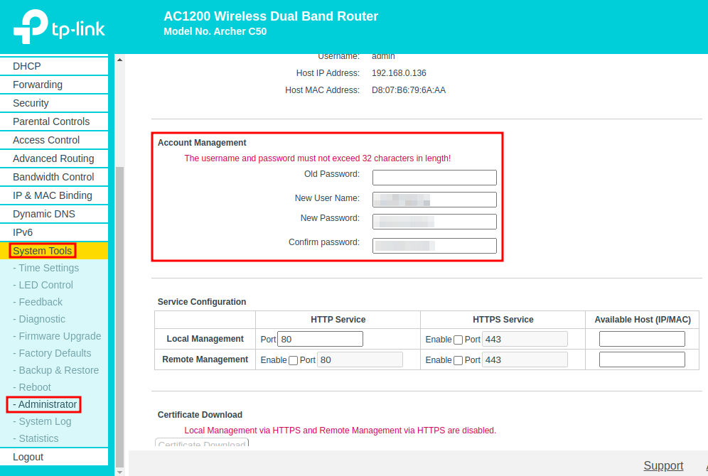
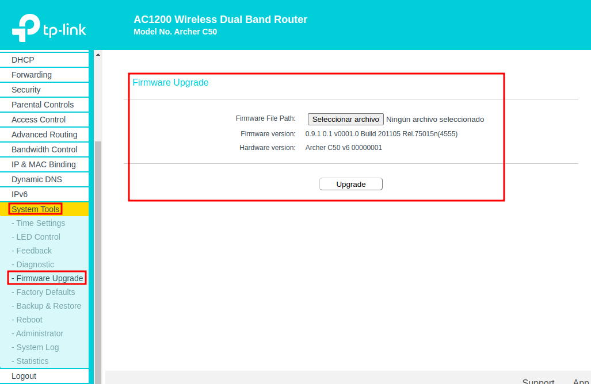
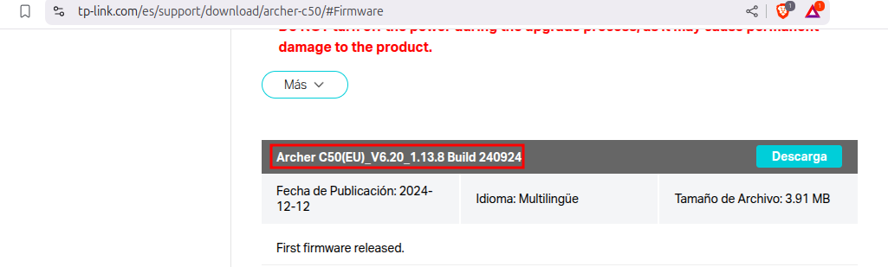
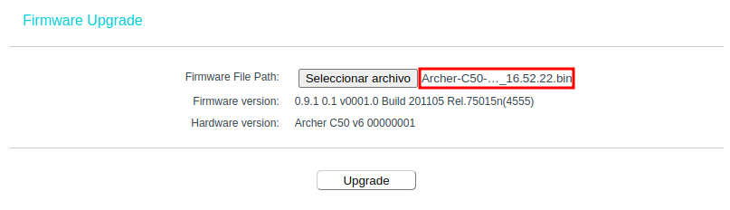
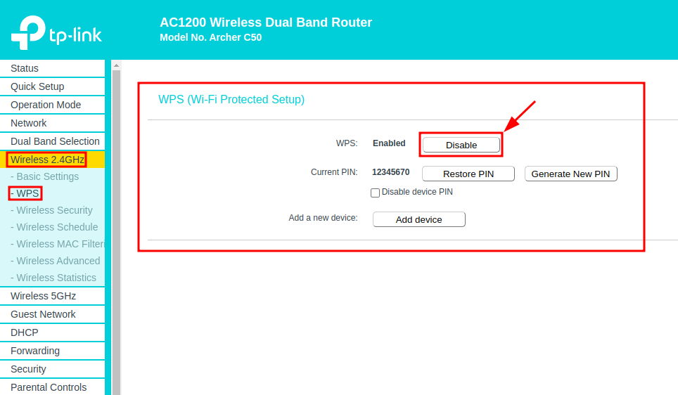
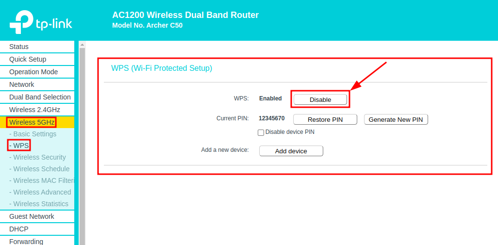
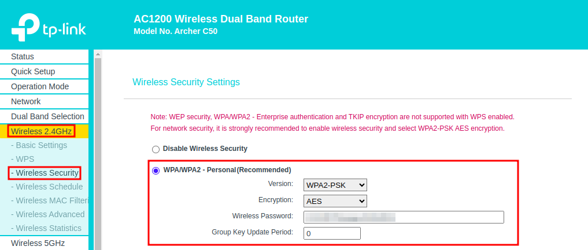
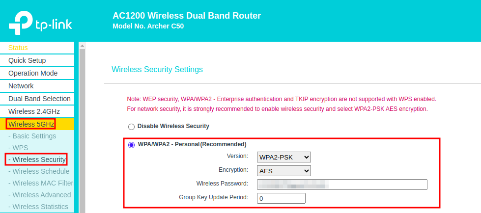
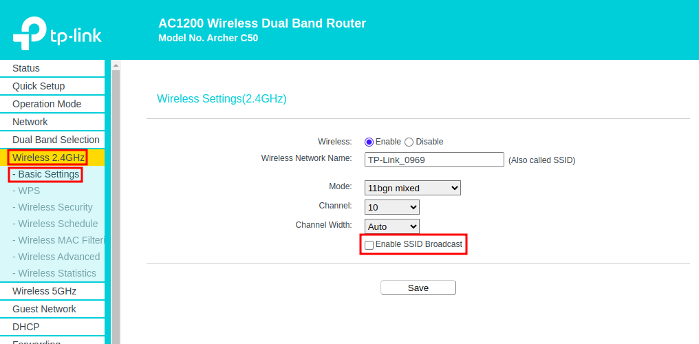
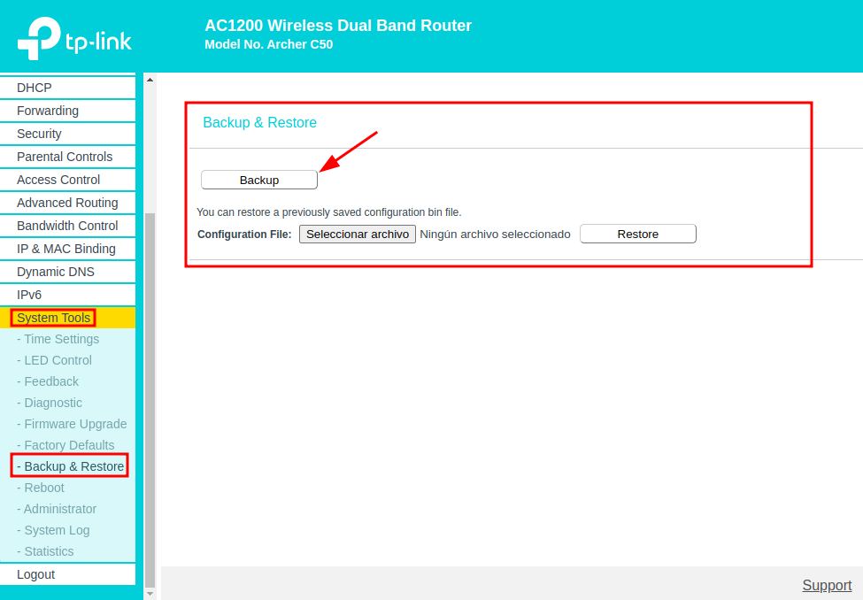

author: Álvaro Caro Fernández
summary: Guía de hardening Router TP-Link Archer C50
id: Proyecto 8
categories: codelab,markdown
environments: Web
status: Publicado

# Guía para bastionar Router TP-Link Archer C50

## ÍNDICE

- [Introducción](#introducción)
- [Paso 1: Configuración inicial](#paso-1-configuración-inicial)
  - [Cambiar credenciales predeterminadas](#cambiar-credenciales-predeterminadas)
  - [Actualizar el firmware](#actualizar-el-firmware)
- [Paso 2: Configuración inalámbrica](#paso-2-configuración-inalámbrica)
  - [Desactivar WPS](#desactivar-wps)
  - [Configurar WPA2/WPA3 y contraseña robusta](#configurar-wpa2wpa3-y-contraseña-robusta)
  - [Ocultar SSID](#ocultar-ssid)
  - [Filtro MAC para WiFi](#filtro-mac-para-wifi)
  - [Crear red para invitados](#crear-red-para-invitados)
- [Paso 3: Configuraciones avanzadas](#paso-3-configuraciones-avanzadas)
  - [Desactivar UPnP](#desactivar-upnp)
  - [Configurar el firewall](#configurar-el-firewall)
  - [Establecer DNS manuales](#establecer-dns-manuales)
- [Paso 4: Mantenimiento y seguridad adicional](#paso-4-mantenimiento-y-seguridad-adicional)
  - [Realizar copia de seguridad de la configuración](#realizar-copia-de-seguridad-de-la-configuración)

---

## Introducción

En esta guía vamos a definir los pasos necesarios para mejorar la seguridad del router **TP-LINK Archer C50**. El objetivo es proteger tanto la red como los dispositivos conectados frente a posibles vulnerabilidades y ataques cibernéticos.

Describiremos cómo cambiar las contraseñas, configurar el cifrado WiFi, desactivar funciones innecesarias y ajustar el firewall. Aplicar estas medidas nos permitirá reforzar la seguridad de nuestra red y garantizar la privacidad de los datos transmitidos.

---

## Paso 1: Configuración inicial

### Cambiar credenciales predeterminadas
1. Accedemos a **System Tools** > **Administration**.
2. Cambiamos el nombre de usuario y la contraseña predeterminados por unos personalizados y seguros.

3. Guardamos los cambios.

### Actualizar el firmware
1. Vamos a **System Tools** > **Firmware Upgrade**.

Como podemos observar nos solicita el archivo para realizar la actualización por lo que accedemos a la página oficial de [TP-Link](https://www.tp-link.com/es/support/download/archer-c50/#Firmware) para buscarlo. Descargamos la última versión estable disponible:

2. Instalamos la versión recién descargada:

---

## Paso 2: Configuración inalámbrica

### Desactivar WPS
1. Accedemos a **Wireless Settings** > **WPS**.
2. Desactivamos la opción **Enable WPS** pulsando el botón `Disable`.

    Red 2.4 GHz:
    

    Red 5 GHz:
    

3. Guardamos los cambios.

---

### Configurar WPA2/WPA3 y contraseña robusta
1. Vamos a **Wireless Security** > **Security**.
2. Seleccionamos WPA3 si está disponible; si no, utilizamos WPA2 con cifrado AES. En este caso seleccionamos WPA2:

    Red 2.4 GHz:
    

    Red 5 GHz:
    

3. Establecemos una contraseña segura (mínimo 16 caracteres, combinando letras, números y símbolos)
4. Guardamos los ajustes.

---

### Ocultar SSID
1. Entramos en **Wireless Settings** > **Basic Settings**.
2. Desactivamos la opción "Broadcast SSID" (Transmitir SSID).

    

3. Aplicamos los cambios.

---

### Filtro MAC para WiFi
1. Accedemos a **Access Control** > **MAC Filtering Settings**.
2. Activamos el filtro MAC y seleccionamos "Permitir" solo para los dispositivos autorizados.
3. Añadimos las direcciones MAC correspondientes.
4. Guardamos los cambios.

---

### Crear red para invitados
1. Vamos a **Guest Network**.
2. Activamos la red en las bandas **2.4 GHz** o **5 GHz**, según sea necesario.
3. Configuramos un nombre único (SSID) y habilitamos el cifrado WPA2 o WPA3.
4. Guardamos los ajustes.

---

## Paso 3: Configuraciones avanzadas

### Desactivar UPnP
1. Accedemos a **Forwarding** > **UPnP Settings**.
2. Desactivamos la opción UPnP.
3. Guardamos los cambios.

### Configurar el firewall
1. Vamos a **Security** > **Firewall Settings**.
2. Activamos las siguientes opciones:
   - Protección contra ataques DoS.
   - Bloqueo de pings ICMP desde Internet.
3. Configuramos reglas específicas para permitir solo tráfico necesario.

### Establecer DNS manuales
1. Accedemos a **Network Settings** > **Internet Settings**.
2. Desactivamos "Obtener DNS automáticamente".
3. Introducimos direcciones DNS confiables, como Google (8.8.8.8, 8.8.4.4) o Cloudflare (1.1.1.1).
4. Aplicamos los cambios.

---

## Paso 4: Mantenimiento y seguridad adicional

### Realizar copia de seguridad de la configuración
1. Vamos a **System Tools** > **Backup & Restore**.
2. Hacemos clic en "Backup" (Copia de seguridad) y guardamos el archivo generado en un lugar seguro.
    